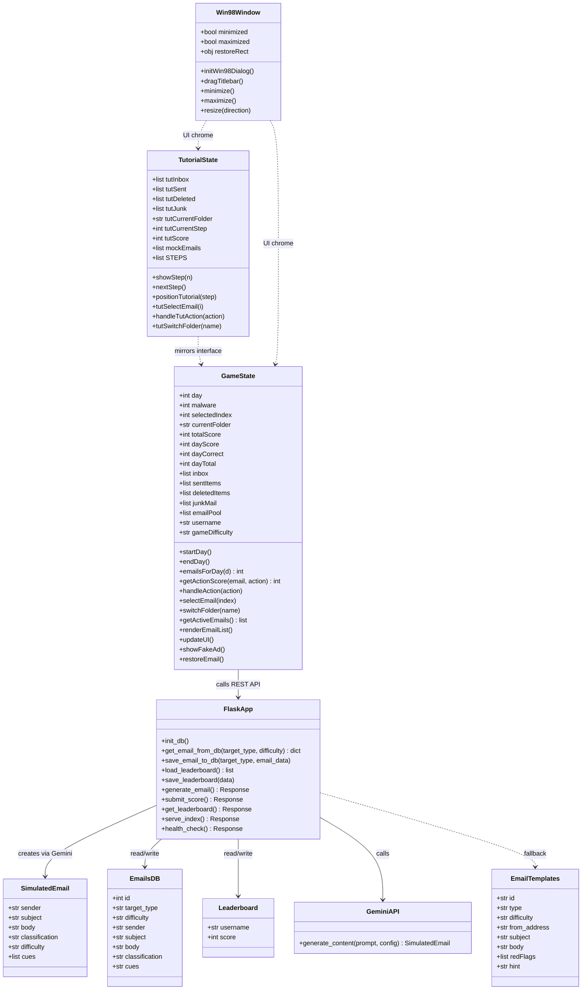

# Class Diagram — Emails Please

```mermaid
classDiagram
    class SimulatedEmail {
        +str sender
        +str subject
        +str body
        +str classification
        +str difficulty
        +list cues
    }

    class FlaskApp {
        +init_db()
        +get_email_from_db(target_type, difficulty) dict
        +save_email_to_db(target_type, email_data)
        +load_leaderboard() list
        +save_leaderboard(data)
        +generate_email() Response
        +submit_score() Response
        +get_leaderboard() Response
        +serve_index() Response
        +health_check() Response
    }

    class EmailsDB {
        +int id
        +str target_type
        +str difficulty
        +str sender
        +str subject
        +str body
        +str classification
        +str cues
    }

    class Leaderboard {
        +str username
        +int score
    }

    class EmailTemplates {
        +str id
        +str type
        +str difficulty
        +str from_address
        +str subject
        +str body
        +list redFlags
        +str hint
    }

    class GeminiAPI {
        +generate_content(prompt, config) SimulatedEmail
    }

    class GameState {
        +int day
        +int malware
        +int selectedIndex
        +str currentFolder
        +int totalScore
        +int dayScore
        +int dayCorrect
        +int dayTotal
        +list inbox
        +list sentItems
        +list deletedItems
        +list junkMail
        +list emailPool
        +str username
        +str gameDifficulty
        +startDay()
        +endDay()
        +emailsForDay(d) int
        +getActionScore(email, action) int
        +handleAction(action)
        +selectEmail(index)
        +switchFolder(name)
        +getActiveEmails() list
        +renderEmailList()
        +updateUI()
        +showFakeAd()
        +restoreEmail()
    }

    class TutorialState {
        +list tutInbox
        +list tutSent
        +list tutDeleted
        +list tutJunk
        +str tutCurrentFolder
        +int tutCurrentStep
        +int tutScore
        +list mockEmails
        +list STEPS
        +showStep(n)
        +nextStep()
        +positionTutorial(step)
        +tutSelectEmail(i)
        +handleTutAction(action)
        +tutSwitchFolder(name)
    }

    class Win98Window {
        +bool minimized
        +bool maximized
        +obj restoreRect
        +initWin98Dialog()
        +dragTitlebar()
        +minimize()
        +maximize()
        +resize(direction)
    }

    FlaskApp --> SimulatedEmail : creates via Gemini
    FlaskApp --> EmailsDB : read/write
    FlaskApp --> Leaderboard : read/write
    FlaskApp --> GeminiAPI : calls
    FlaskApp ..> EmailTemplates : fallback
    GameState --> FlaskApp : calls REST API
    TutorialState ..> GameState : mirrors interface
    Win98Window ..> GameState : UI chrome
    Win98Window ..> TutorialState : UI chrome
```
