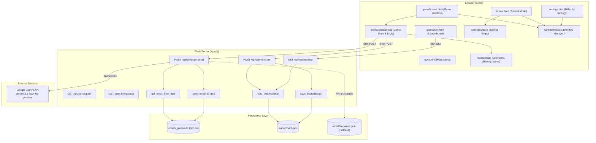

# Component / Architecture Diagram — Emails Please

```mermaid
graph TD
    subgraph Browser["Browser (Client)"]
        index["index.html (Main Menu)"]
        game["gameScreen.html (Game Interface)"]
        tutorial["tutorial.html (Tutorial Mode)"]
        settings["settings.html (Difficulty Settings)"]
        gameOver["gameOver.html (Leaderboard)"]
        animJS["animationsScript.js (Game State & Logic)"]
        tutJS["tutorialScript.js (Tutorial Steps)"]
        win98JS["win98Window.js (Window Manager)"]
        localStorage["localStorage (username, difficulty, sound)"]
    end

    subgraph Flask["Flask Server (app.py)"]
        routeGenEmail["POST /api/generate-email"]
        routeScore["POST /api/submit-score"]
        routeLeaderboard["GET /api/leaderboard"]
        routeResources["GET /resources/path"]
        routeHTML["GET /path (templates)"]
        getEmail["get_email_from_db()"]
        saveEmail["save_email_to_db()"]
        loadLB["load_leaderboard()"]
        saveLB["save_leaderboard()"]
    end

    subgraph Persistence["Persistence Layer"]
        sqlite[("emails_please.db (SQLite)")]
        lbJSON[("leaderboard.json")]
        templates[("emailTemplates.json (Fallback)")]
    end

    subgraph External["External Services"]
        gemini["Google Gemini API\ngemini-3.1-flash-lite-preview"]
    end

    game --> animJS
    tutorial --> tutJS
    game --> win98JS
    tutorial --> win98JS
    settings --> win98JS
    animJS --> localStorage

    animJS -->|"fetch POST"| routeGenEmail
    animJS -->|"fetch POST"| routeScore
    gameOver -->|"fetch GET"| routeLeaderboard

    routeGenEmail --> getEmail
    routeGenEmail --> saveEmail
    routeGenEmail -->|"cache miss"| gemini
    routeScore --> loadLB
    routeScore --> saveLB
    routeLeaderboard --> loadLB

    getEmail --> sqlite
    saveEmail --> sqlite
    loadLB --> lbJSON
    saveLB --> lbJSON
    routeGenEmail -.->|"API unavailable"| templates
```
