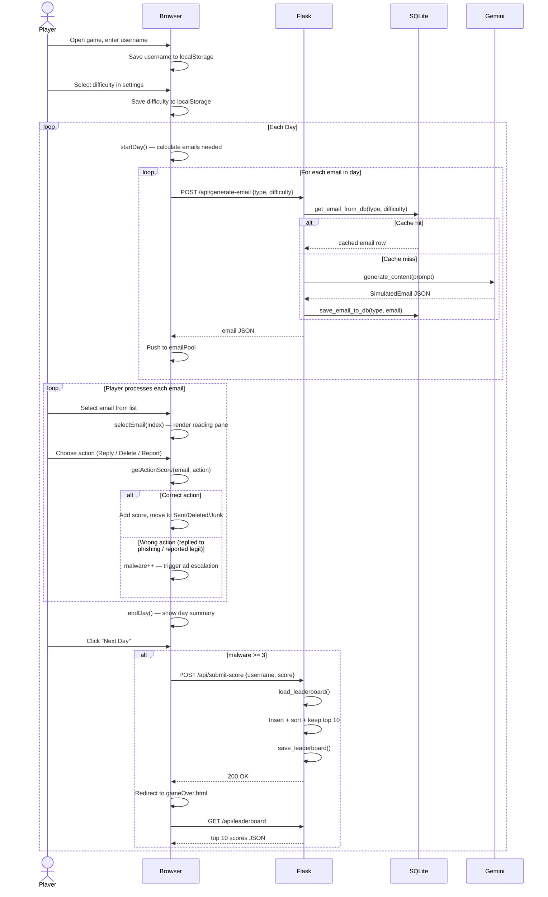

# Sequence Diagram — Email Generation & Game Loop

```mermaid
sequenceDiagram
    actor Player
    participant Browser
    participant Flask
    participant SQLite
    participant Gemini

    Player->>Browser: Open game, enter username
    Browser->>Browser: Save username to localStorage
    Player->>Browser: Select difficulty in settings
    Browser->>Browser: Save difficulty to localStorage

    loop Each Day
        Browser->>Browser: startDay() — calculate emails needed
        loop For each email in day
            Browser->>Flask: POST /api/generate-email {type, difficulty}
            Flask->>SQLite: get_email_from_db(type, difficulty)
            alt Cache hit
                SQLite-->>Flask: cached email row
            else Cache miss
                Flask->>Gemini: generate_content(prompt)
                Gemini-->>Flask: SimulatedEmail JSON
                Flask->>SQLite: save_email_to_db(type, email)
            end
            Flask-->>Browser: email JSON
            Browser->>Browser: Push to emailPool
        end

        loop Player processes each email
            Player->>Browser: Select email from list
            Browser->>Browser: selectEmail(index) — render reading pane
            Player->>Browser: Choose action (Reply / Delete / Report)
            Browser->>Browser: getActionScore(email, action)
            alt Correct action
                Browser->>Browser: Add score, move to Sent/Deleted/Junk
            else Wrong action (replied to phishing / reported legit)
                Browser->>Browser: malware++ — trigger ad escalation
            end
        end

        Browser->>Browser: endDay() — show day summary
        Player->>Browser: Click "Next Day"

        alt malware >= 3
            Browser->>Flask: POST /api/submit-score {username, score}
            Flask->>Flask: load_leaderboard()
            Flask->>Flask: Insert + sort + keep top 10
            Flask->>Flask: save_leaderboard()
            Flask-->>Browser: 200 OK
            Browser->>Browser: Redirect to gameOver.html
            Browser->>Flask: GET /api/leaderboard
            Flask-->>Browser: top 10 scores JSON
        end
    end
```
