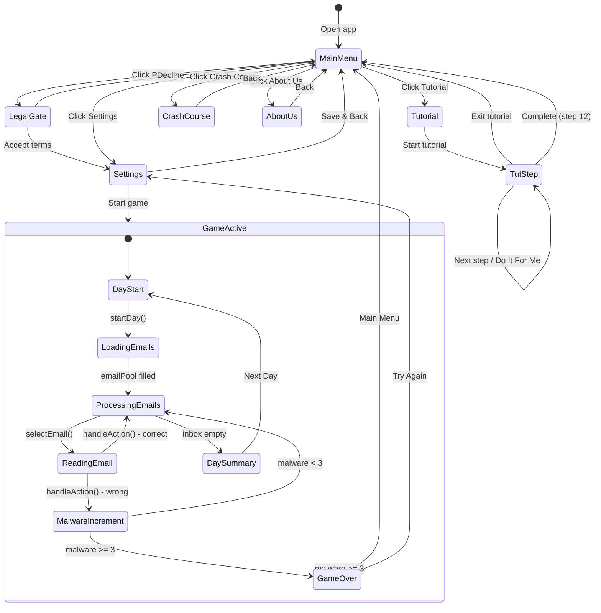

# State Diagram — Game Flow

```mermaid
stateDiagram-v2
    [*] --> MainMenu : Open app

    MainMenu --> LegalGate : Click Play
    LegalGate --> Settings : Accept terms
    LegalGate --> MainMenu : Decline
    MainMenu --> Tutorial : Click Tutorial
    MainMenu --> Settings : Click Settings
    MainMenu --> CrashCourse : Click Crash Course
    MainMenu --> AboutUs : Click About Us

    Settings --> MainMenu : Save & Back

    Tutorial --> TutStep : Start tutorial
    TutStep --> TutStep : Next step / Do It For Me
    TutStep --> MainMenu : Exit tutorial
    TutStep --> MainMenu : Complete (step 12)

    Settings --> GameActive : Start game

    state GameActive {
        [*] --> DayStart
        DayStart --> LoadingEmails : startDay()
        LoadingEmails --> ProcessingEmails : emailPool filled
        ProcessingEmails --> ReadingEmail : selectEmail()
        ReadingEmail --> ProcessingEmails : handleAction() - correct
        ReadingEmail --> MalwareIncrement : handleAction() - wrong
        MalwareIncrement --> ProcessingEmails : malware < 3
        MalwareIncrement --> GameOver : malware >= 3
        ProcessingEmails --> DaySummary : inbox empty
        DaySummary --> DayStart : Next Day
    }

    GameActive --> GameOver : malware >= 3
    GameOver --> MainMenu : Main Menu
    GameOver --> Settings : Try Again

    CrashCourse --> MainMenu : Back
    AboutUs --> MainMenu : Back
```
